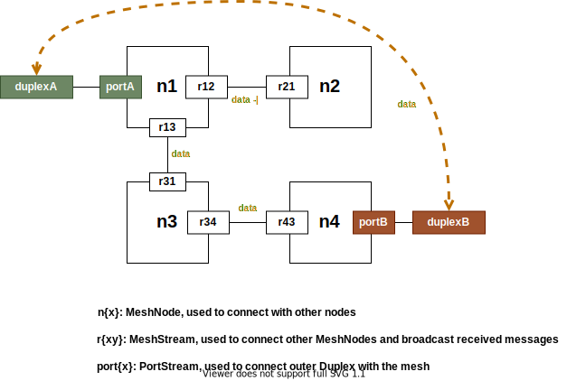

# @jacobbubu/pull-mesh

> 创建一个通信网格 (mesh)，用于在不确定的网络连通的环境下实现两个 pull duplex 通信

## 概述

`pull-mesh` 试图解决一个问题，即两个仅仅知道名字(URI)的 duplex 如何通过一个相互连通的网格来建立连接。如下图: `duplexA` 和 `duplexB` 之间存在一个网格(mesh)，网格各个节点之间有些相连，有些是中断的。只要存在一条相连的通路，`duplexA` 和 `duplexB` 即可相互连接。

## 示例

[两节点直连](./examples/two-nodes.ts)的例子展示了最简单的情况。其示意图如下:

`one` 和 `two` 分别是两端的 duplex 名字，我们用 `sourceURI` 来标识。`one` 和 `two` 为了连接到 mesh，首先需要和它们所知道的 `meshNode` 建立连接。这是通过 `meshNode.createPortStream(sourceURI, destURI)` 来完成的。`destURI` 标记了当前 duplex 希望连接的远端的 duplex 的名字。在整个 mesh 网格内，URI 应该是唯一的。`one` 和 `two` 不知道对方的具体的位置或地址，消息由 `meshNode` 之间转发来完成。

`portStream` 可以在 `meshNode` 事先创建好，也可以通过 `meshNode` 在构造时传入的 `onOpenPort` 回调函数来创建。[两节点直连](./examples/two-nodes.ts) 演示了这种用法。

`meshNode` 之间会创建 `relayStream`。`relayStream` 负责将两个 `meshNode` 连接，它也仅仅负责这件事，对所要传播的 `message` 的语义并不关心。

还有两个例子演示了更复杂一些的用法:
* [同步 scuttlebutt 数据结构](./examples/model.ts): 这个例子演示了如何在两个节点间同步 scuttlebutt model。
* [三节点同步](./examples/three-nodes.ts): 顾名思义，从两节点变成三节点。

### 节点间消息是如何传播的

每个消息都有一个全网唯一的 id。`meshNode` 在收到消息后，首先会发给所有它所拥有的的 `portStream`，如果没有一个 `portStream` 能处理，则逐一发给它的 `relayStream`。这些 `relayStream` 将把消息传递给其他 `meshNode`，继而重复上述步骤。为了避免消息在 `meshNode` 之间重复传递，每个 `relayStream` 确保在一段时间内具有相同 `id` 的消息仅仅传输一次，重复收到的消息将被丢弃。

## 注意

该模块目前仅仅出于验证概念阶段，大量的测试用例和连通检测功能还有待完善。
